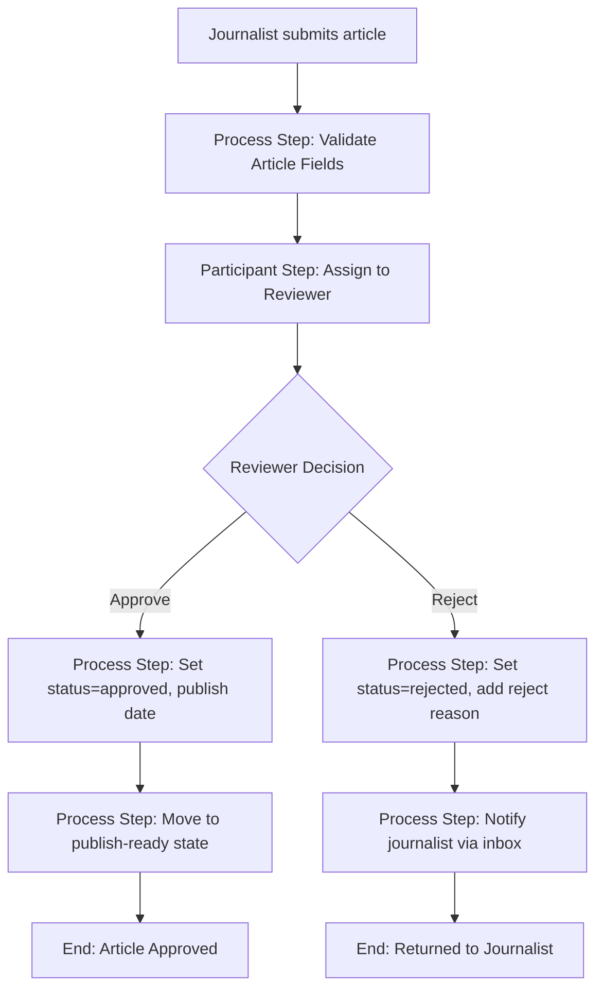

# News Portal (VnExpress-style) - Implementation Plan

## Scope of YOUR Task

Your personal task within the 4-person team covers:
- **i18n setup** (Vietnamese + English) - prerequisite for everything
- **Navigation** component (categories dropdown like VnExpress)
- **Breadcrumb** component (article detail context)
- **Latest News** component (with Sling Model + OSGi Service + caching)
- **Page Item** component (article card: image, title, summary)
- **Article Approval Workflow** (journalist submits, reviewer approves/rejects)
- **Content Fragment Model** for articles (to support headless/API exposure later)
- **Content structure** (8 categories x 4 sub-topics via repo init)

---

## Phase 0: i18n Setup (Vietnamese + English)

### Site Structure for Multi-language

Current structure is `/content/mysite/us/en`. We need to restructure for i18n with Live Copy:

```
/content/mysite/                     (site root)
  /vi/                               (Vietnamese - language master)
    jcr:language = "vi"
    /thoi-su/                        (category pages under vi)
    /the-gioi/
    ...
  /en/                               (English - live copy of /vi)
    jcr:language = "en"
    /current-affairs/
    /world-news/
    ...
```

### i18n Dictionary Files

Location: [ui.apps/.../apps/mysite/i18n/](ui.apps/src/main/content/jcr_root/apps/mysite/i18n/)

Create two dictionary files using `sling:basename` approach:

**`vi.json`** - Vietnamese (source language)

```json
{
  "nav.home": "Trang chu",
  "nav.current-affairs": "Thoi su",
  "nav.world": "The gioi",
  "nav.business": "Kinh doanh",
  "nav.sports": "The thao",
  "nav.education": "Giao duc",
  "nav.health": "Suc khoe",
  "nav.travel": "Du lich",
  "nav.science-tech": "Khoa hoc & Cong nghe",
  "latest.title": "Tin moi nhat",
  "article.author": "Tac gia",
  "article.published": "Ngay dang",
  "article.readmore": "Doc them",
  "breadcrumb.home": "Trang chu",
  "footer.copyright": "Ban quyen (c) {0} MySite News."
}
```

**`en.json`** - English

```json
{
  "nav.home": "Home",
  "nav.current-affairs": "Current Affairs",
  "nav.world": "World News",
  "nav.business": "Business",
  "nav.sports": "Sports",
  "nav.education": "Education",
  "nav.health": "Health",
  "nav.travel": "Travel",
  "nav.science-tech": "Science & Tech",
  "latest.title": "Latest News",
  "article.author": "Author",
  "article.published": "Published Date",
  "article.readmore": "Read More",
  "breadcrumb.home": "Home",
  "footer.copyright": "Copyright (c) {0} MySite News."
}
```

Each `.json` file needs a companion `.json.dir/.content.xml` with:
```xml
<jcr:root ... jcr:language="vi" jcr:mixinTypes="[mix:language]" 
  jcr:primaryType="nt:unstructured" sling:basename="mysite"/>
```

In HTL, use: `${'nav.home' @ i18n, locale=currentPage.language}`

---

## Phase 1: Content Structure (8 Categories x 4 Sub-topics)

### Selected Categories (based on VnExpress)

| # | ID (vi) | Vietnamese | English | Sub-topics (vi) | Sub-topics (en) |
|---|---------|-----------|---------|-----------------|-----------------|
| 1 | thoi-su | Thoi su | Current Affairs | chinh-tri, giao-thong, moi-truong, goc-nhin | politics, traffic, environment, perspective |
| 2 | the-gioi | The gioi | World News | phan-tich, quan-su, cuoc-song-do-day, nguoi-viet-5-chau | analysis, military, life-abroad, vietnamese-overseas |
| 3 | kinh-doanh | Kinh doanh | Business | chung-khoan, bat-dong-san, doanh-nghiep, vi-mo | stock-market, real-estate, enterprises, macro-economy |
| 4 | the-thao | The thao | Sports | bong-da, tennis, cac-mon-khac, hau-truong | football, tennis, other-sports, behind-the-scenes |
| 5 | giao-duc | Giao duc | Education | tuyen-sinh, du-hoc, trac-nghiem, giao-duc-4-0 | admissions, study-abroad, quizzes, education-4-0 |
| 6 | suc-khoe | Suc khoe | Health | dinh-duong, cac-benh, khoe-dep, tu-van | nutrition, diseases, wellness-beauty, consultation |
| 7 | du-lich | Du lich | Travel | diem-den, am-thuc, cam-nang, dau-chan | destinations, cuisine, travel-guide, footprints |
| 8 | khoa-hoc-cong-nghe | Khoa hoc & Cong nghe | Science and Tech | ai, chuyen-doi-so, doi-moi-sang-tao, vu-tru | ai, digital-transformation, innovation, space |

### JCR Content Tree

```
/content/mysite/
  vi/                          (language master, jcr:language="vi")
    thoi-su/
      chinh-tri/
      giao-thong/
      moi-truong/
      goc-nhin/
    the-gioi/
      phan-tich/
      quan-su/
      cuoc-song-do-day/
      nguoi-viet-5-chau/
    ... (6 more categories)
  en/                          (live copy, jcr:language="en")
    current-affairs/
      politics/
      traffic/
      environment/
      perspective/
    world-news/
      analysis/
      military/
      life-abroad/
      vietnamese-overseas/
    ... (6 more categories)
```

These pages are created via `ui.content` repo init XML files. Each category page uses `page-content` template, with `jcr:title` set in respective language.

---

## Phase 2: Content Fragment Model for Articles

### CF Model: "Article" (`/conf/mysite/settings/dam/cfm/models/article`)

Location: [ui.content/.../conf/mysite/settings/dam/](ui.content/src/main/content/jcr_root/conf/mysite/settings/dam/.content.xml)

Fields:

| Field | Type | Required | Notes |
|-------|------|----------|-------|
| headline | single-line-text | yes | Article title / headline |
| summary | multi-line-text (plain) | yes | Short description for cards |
| body | multi-line-text (rich-text) | yes | Full article content |
| featuredImage | content-reference | yes | Path to DAM asset |
| author | single-line-text | yes | Author name |
| publishedDate | date-time | yes | Publication date |
| category | enumeration | yes | One of 8 category IDs |
| tags | tag | no | cq:tags for classification |

This CF model allows articles to be:
- Rendered via Content Fragment component on detail pages
- Exposed as JSON via Sling Model Exporter for headless
- Queried programmatically via QueryBuilder

---

## Phase 3: Components Implementation

### 3.1 Navigation Component (VnExpress-style dropdown)

**Location:** [ui.apps/.../components/navigation/](ui.apps/src/main/content/jcr_root/apps/mysite/components/navigation/.content.xml)

Already proxied from `core/wcm/components/navigation/v2/navigation`. We override the HTL to add dropdown behavior.

Files to create/modify:
- `navigation/navigation.html` - custom HTL with dropdown markup
- `navigation/_cq_dialog/.content.xml` - add structureDepth, navigationRoot dialog fields
- Sling Model: `NavigationModel.java` (optional, can rely on Core Navigation model)
- CSS in clientlib: dropdown styles, hover states, mobile hamburger toggle

**HTL structure (navigation.html):**

```html
<nav class="news-nav" data-sly-use.nav="com.mysite.core.models.NavigationModel"
     aria-label="${'nav.main' @ i18n}">
  <ul class="news-nav__list">
    <li data-sly-repeat="${nav.items}" class="news-nav__item 
        ${item.children ? 'has-dropdown' : ''}">
      <a href="${item.url}" class="news-nav__link">${item.title}</a>
      <ul data-sly-test="${item.children}" class="news-nav__dropdown">
        <li data-sly-repeat.child="${item.children}" class="news-nav__dropdown-item">
          <a href="${child.url}">${child.title}</a>
        </li>
      </ul>
    </li>
  </ul>
</nav>
```

**Key design:** Use Core Navigation with `structureDepth=2` (categories + sub-topics). Override rendering only, not logic.

---

### 3.2 Breadcrumb Component

**Location:** [ui.apps/.../components/breadcrumb/](ui.apps/src/main/content/jcr_root/apps/mysite/components/breadcrumb/)

Already proxied from Core Breadcrumb. Override HTL for news-style breadcrumb.

Files:
- `breadcrumb/breadcrumb.html` - custom HTL
- CSS in clientlib

**HTL:**

```html
<nav class="news-breadcrumb" data-sly-use.breadcrumb="com.adobe.cq.wcm.core.components.models.Breadcrumb"
     aria-label="Breadcrumb">
  <ol class="news-breadcrumb__list" itemscope itemtype="http://schema.org/BreadcrumbList">
    <li data-sly-repeat="${breadcrumb.items}" class="news-breadcrumb__item" 
        itemprop="itemListElement" itemscope itemtype="http://schema.org/ListItem">
      <a data-sly-test="${!itemList.last}" href="${item.URL}" itemprop="item">
        <span itemprop="name">${item.title}</span>
      </a>
      <span data-sly-test="${itemList.last}" itemprop="name">${item.title}</span>
      <meta itemprop="position" content="${itemList.count}"/>
    </li>
  </ol>
</nav>
```

---

### 3.3 Latest News Component (with caching)

**Location:** new component `ui.apps/.../components/latest-news/`

This is a custom component (not a Core proxy). It needs:

#### Sling Model: `LatestNewsModel.java`

```
@Model(adaptables = SlingHttpServletRequest.class,
       defaultInjectionStrategy = DefaultInjectionStrategy.OPTIONAL)
```

- Dialog properties: `rootPath` (configurable root), `limit` (default 10)
- Injects `@OSGiService LatestNewsService`
- Returns `List<ArticleItem>` (DTO with title, summary, image, url, publishedDate)

#### OSGi Service: `LatestNewsService.java` (interface) + `LatestNewsServiceImpl.java`

```
Location: core/src/main/java/com/mysite/core/services/
```

**Design:**
- Interface: `List<ArticleItem> getLatestArticles(String rootPath, int limit)`
- Implementation uses `QueryBuilder` to find child pages sorted by `jcr:content/cq:lastModified` DESC
- **Caching:** Use `@Activate`/`@Modified` with a Guava Cache or ConcurrentHashMap with TTL
  - Cache key = `rootPath + ":" + limit`
  - TTL = 5 minutes (configurable via OSGi config)
  - Invalidation: register a `ResourceChangeListener` on the rootPath to bust cache on content changes

#### DTO: `ArticleItem.java`

```
Location: core/src/main/java/com/mysite/core/models/dto/
```

Fields: `title`, `summary`, `imagePath`, `url`, `author`, `publishedDate`, `categoryTitle`

#### HTL: `latest-news.html`

```html
<div class="latest-news" data-sly-use.model="com.mysite.core.models.LatestNewsModel">
  <h2 class="latest-news__title">${'latest.title' @ i18n}</h2>
  <div class="latest-news__grid">
    <article data-sly-repeat="${model.articles}" class="latest-news__card">
      <sly data-sly-use.tpl="core/wcm/components/commons/v1/templates.html">
        <!-- reuse page-item component via sly include or inline -->
      </sly>
      <a href="${item.url}" class="latest-news__card-link">
        
        <h3 class="latest-news__card-title">${item.title}</h3>
        <p class="latest-news__card-summary">${item.summary}</p>
        <time class="latest-news__card-date">${item.publishedDate}</time>
      </a>
    </article>
  </div>
</div>
```

#### Dialog: `_cq_dialog/.content.xml`

Fields:
- `rootPath` (pathfield) - root path to query articles from
- `limit` (numberfield) - max articles to show (default 10)

---

### 3.4 Page Item Component (Article Card)

**Location:** new component `ui.apps/.../components/page-item/`

A reusable card component. Can be used standalone or composed inside Latest News.

#### Sling Model: `PageItemModel.java`

Adaptable from `Resource`. Reads from the page node:
- `title` from `jcr:content/jcr:title`
- `summary` from `jcr:content/jcr:description` or a custom `summary` property
- `imagePath` from `jcr:content/image/fileReference`
- `url` - page path + `.html`
- `publishedDate` from `jcr:content/cq:lastModified` or custom date field

#### HTL: `page-item.html`

```html
<article class="page-item" data-sly-use.model="com.mysite.core.models.PageItemModel">
  <a href="${model.url}" class="page-item__link">
    <div class="page-item__image-wrapper">
      
    </div>
    <div class="page-item__content">
      <h3 class="page-item__title">${model.title}</h3>
      <p class="page-item__summary">${model.summary}</p>
      <time class="page-item__date" datetime="${model.publishedDate}">
        ${model.formattedDate}
      </time>
    </div>
  </a>
</article>
```

#### Dialog

- `pagePath` (pathfield) - path to the target article page (for standalone use)
- Or inherits from parent resource when used as part of Latest News listing

---

## Phase 4: Article Approval Workflow

### Workflow Design: "Article Review and Approval"



### Participants

- **Journalist group:** `journalists` (AEM user group) - creates and submits articles
- **Reviewer group:** `reviewers` (AEM user group) - reviews and approves/rejects

### Workflow Steps to Implement

**Existing steps to refactor/reuse:**
- [ApprovePageContentStep.java](core/src/main/java/com/mysite/core/workflow/ApprovePageContentStep.java) - has a bug on line 34 (uses `getPayloadType()` instead of `getPayload().toString()`); fix and adapt for article review routing

**New steps to create:**

1. **`ValidateArticleStep.java`** (`WorkflowProcess`)
   - Validates that required fields exist: `jcr:title`, `jcr:description`, `image/fileReference`
   - If validation fails, terminates workflow with error metadata
   - Sets `articleStatus = "pending-review"` on jcr:content

2. **`AssignReviewerStep.java`** (`ParticipantStepChooser`)
   - Routes to `reviewers` group for content under `/content/mysite`
   - Could route to specific category editors based on page path

3. **`ApproveArticleStep.java`** (`WorkflowProcess`)
   - Sets `articleStatus = "approved"` on jcr:content
   - Sets `approvedBy` and `approvedDate` metadata
   - Optionally triggers replication/activation

4. **`RejectArticleStep.java`** (`WorkflowProcess`)
   - Sets `articleStatus = "rejected"` on jcr:content
   - Stores reject reason from workflow dialog/comment
   - Sends notification to journalist via AEM Inbox

### Workflow Model XML

Create at: `ui.content/src/main/content/jcr_root/var/workflow/models/article-review/`

Or configure via AEM Workflow Editor and export. The model defines:
1. Start -> Process Step (Validate)
2. Dynamic Participant Step (Assign Reviewer)
3. Participant Step (Reviewer reviews in inbox)
4. OR Split: approve path vs reject path
5. Process Steps for approve/reject actions
6. End

### Custom Page Properties for Workflow

Add to article pages via `jcr:content`:
- `articleStatus`: pending-review | approved | rejected | draft
- `approvedBy`: user who approved
- `approvedDate`: approval timestamp
- `rejectedReason`: text if rejected

---

## Phase 5: ClientLibs

### New clientlib: `clientlib-site` (category: `mysite.site`)

Location: [ui.apps/.../clientlibs/clientlib-site/](ui.apps/src/main/content/jcr_root/apps/mysite/clientlibs/clientlib-site/)

**CSS files:**
- `css/navigation.css` - dropdown nav, hover states, hamburger mobile
- `css/breadcrumb.css` - breadcrumb styles
- `css/latest-news.css` - grid layout for news cards
- `css/page-item.css` - article card styles (hover/focus states)
- `css/responsive.css` - breakpoints (768px phone, 1200px tablet as per existing template config)

**JS files:**
- `js/navigation.js` - mobile hamburger toggle, dropdown keyboard accessibility

**`css.txt`:**
```
#base=css
navigation.css
breadcrumb.css
latest-news.css
page-item.css
responsive.css
```

**`js.txt`:**
```
#base=js
navigation.js
```

---

## Summary of Files to Create/Modify

### New Java Classes (`core/src/main/java/com/mysite/core/`)

| File | Type |
|------|------|
| `models/LatestNewsModel.java` | Sling Model |
| `models/PageItemModel.java` | Sling Model |
| `models/dto/ArticleItem.java` | DTO |
| `services/LatestNewsService.java` | OSGi Service Interface |
| `services/impl/LatestNewsServiceImpl.java` | OSGi Service Impl |
| `workflow/ValidateArticleStep.java` | WorkflowProcess |
| `workflow/AssignReviewerStep.java` | ParticipantStepChooser |
| `workflow/ApproveArticleStep.java` | WorkflowProcess |
| `workflow/RejectArticleStep.java` | WorkflowProcess |

### New/Modified ui.apps Files

| File | Action |
|------|--------|
| `components/navigation/navigation.html` | Create (override Core HTL) |
| `components/breadcrumb/breadcrumb.html` | Create (override Core HTL) |
| `components/latest-news/.content.xml` | Create new component |
| `components/latest-news/_cq_dialog/.content.xml` | Create |
| `components/latest-news/latest-news.html` | Create |
| `components/page-item/.content.xml` | Create new component |
| `components/page-item/_cq_dialog/.content.xml` | Create |
| `components/page-item/page-item.html` | Create |
| `clientlibs/clientlib-site/` | Create with CSS + JS |
| `i18n/vi.json` + `en.json` | Create |

### New/Modified ui.content Files

| File | Action |
|------|--------|
| `conf/mysite/settings/dam/cfm/models/article/` | Create CF model |
| `content/mysite/vi/` (+ all category pages) | Create |
| `content/mysite/en/` (+ all category pages) | Create |
| `conf/mysite/settings/wcm/templates/article-detail/` | Create template |

---

## Implementation Order (recommended)

1. **i18n** - setup vi.json, en.json, dictionary nodes (prerequisite)
2. **Content structure** - create vi/ and en/ language roots + category/sub-topic pages
3. **Content Fragment Model** - article model in conf/mysite/settings/dam/cfm/models
4. **Page Item component** - simplest component, reusable
5. **Navigation component** - override HTL + CSS for dropdown
6. **Breadcrumb component** - override HTL
7. **Latest News component** - Sling Model + Service + caching + HTL
8. **Article Approval Workflow** - all 4 workflow steps + workflow model
9. **ClientLibs** - consolidate all CSS/JS
10. **Fix existing bugs** - ApprovePageContentStep line 34 bug
